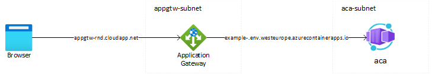

# Configure Azure Container Apps with Application Gateway (Default domain)

> **Note**
> This sample is part of the [Centralized inbound gateway options for Azure Container Apps - Configure ACA with Application Gateway (Terraform sample)](https://medium.com/@gjoshevski/centralized-inbound-gateway-options-for-azure-container-apps-configure-aca-with-application) blog post.

In this repo you can find an example of how to configure your Application Gateway and Azure Container apps using the default domain. 

The host header in the original request received by the Application Gateway will be different from the host name of the backend Azure Container App.

